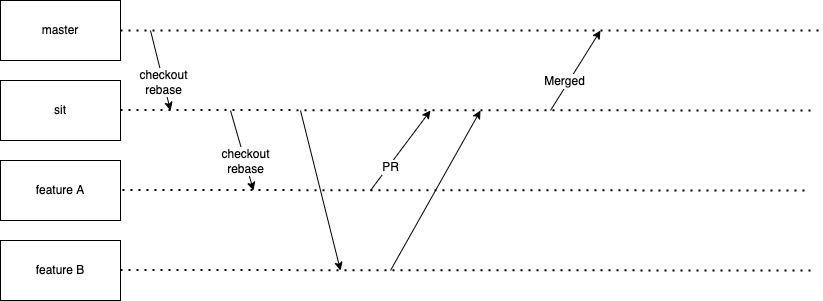
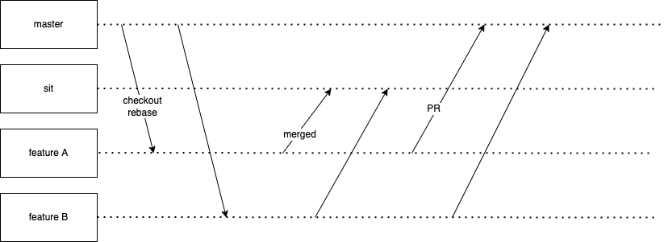

# gitOps
## Advantage
* Consistency. Avoid missing deployment
* Continious Testing. e.g. dry run
* CD
* Version Control for microservices.

## git flow
* PR to sit

* PR to master

## Meeting Notes
* 請 DevOps 建立新 namespace 
* sit 仍需手動的項目：
  * upgrade image with latest tag, restart deployment
  * delete resource
  * change secret content, restart deployment
